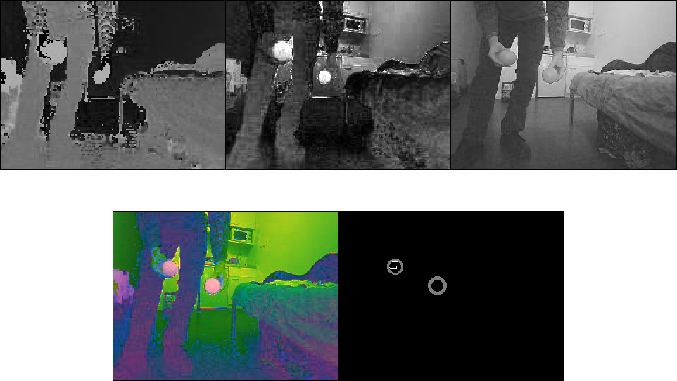

.. _red_ball_tracker:

Red Ball Tracker
================

This node is designed to find the nearest red ball present in an image stream
and send its coordinate in the camera referential.

To run it:

* :command:`rosrun red_ball_tracker red_ball_tracker`

Display Tracking
----------------

During the run, you can see the processed images using:

* :command:`rosrun red_ball_tracker display_tracking`

This will display this kind of images:

.. _tracking:

Parameters
----------

You can change the following parameters using :command:`rosparam`:

.. tabularcolumns:: |p{2.5cm}|p{1.2cm}|L|

================ ====== ==============================================
Name             Type   Description                            
================ ====== ==============================================
min_hue          int    Min **hue** value for ball detection.
---------------- ------ ----------------------------------------------
min_saturation   int    Min **saturation** value for ball detection.
---------------- ------ ----------------------------------------------
min_lightness    int    Min **lightness** value for ball detection.
---------------- ------ ----------------------------------------------
max_hue          int    Max **hue** value for ball detection.
---------------- ------ ----------------------------------------------
max_saturation   int    Max **saturation** value for ball detection.
---------------- ------ ----------------------------------------------
max_lightness    int    Max **lightness** value for ball detection.
================ ====== ==============================================

Messages
--------

Here is the list of the messages used by the node.

Publishers
++++++++++

.. tabularcolumns:: |p{3.4cm}|p{3.1cm}|L|

+--------------------+---------------------+-----------------------------------------------+
| Name               | Type                | Decritption                                   |
+====================+=====================+===============================================+
| ardrone/image_raw/ | red_ball_tracker/   | Discribe the position of the ball in the      |
| red_ball_tracking  | TrackerMsg          | camera referential.                           |
+--------------------+---------------------+-----------------------------------------------+
| ardrone/image_raw/ | std_msgs/Empty      | Display tracking when someone subscribe       |
| display_tracking   |                     | to this message.                              |
+--------------------+---------------------+-----------------------------------------------+

Subscribers
+++++++++++

.. tabularcolumns:: |p{3.4cm}|p{3.3cm}|L|

+--------------------+---------------------+-----------------------------------------------+
| Name               | Type                | Decritption                                   |
+====================+=====================+===============================================+
| ardrone/image_raw  | sensor_msgs/Image   | Reset message for the ARDrone driver.         |
+--------------------+---------------------+-----------------------------------------------+

Custom Messages
+++++++++++++++

We provide a custom message for the tracker:

* red_ball_tracker/TrackerMsg:
  
  ========== ======== ======================================================
  Attribute  Type       Description
  ========== ======== ======================================================
  alphax     float32    Angle between center and ball (horizontal component).
  alphay     float32    Angle between center and ball (vertical component).
  distance   float32    Distance to the ball.
  ========== ======== ======================================================